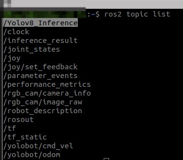
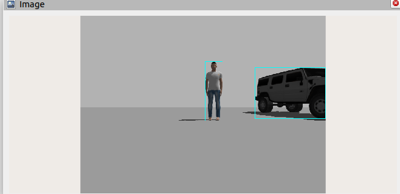
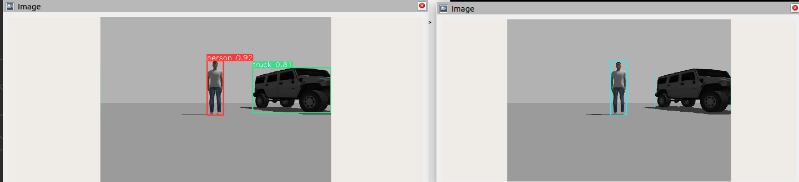

# How to install yolobot 

# Requirments

install pip using the following command 
```
sudo apt install python3-pip
```
install ultralytics package 

```
pip3 install ultralytics
```
install gazebo
```
sudo apt install gazebo
```
Install the python3 colcon common extension
```
sudo apt install python3-colcon-common-extensions
```
Colcon is a command line tool to improve the workflow of building, testing and using multiple software packagesit automates the process handles the ordering and sets up the environment to use the packages.

install the ros humble gazebo package

```
sudo apt install ros-humble-gazebo-ros
```
Download and unzip the the repo. 
```
git clone  
```

## Simulation: 

open the project directory and excute the following command 

```
colcon build
```

To launch the simulation execute the source command and launch the yolobot.pi script file

```
ros2 launch yolobot_gazebo yolobot_launch.py
```

open another terminal and execute the source command and then execute the follwing command for ros topic list

```
ros2 topic list
```
  
and **Yolov8_Inference** is the custom topic that is defined.

By executing raw's 2 topic Echo command we can see that recognized object information is being published as we intended

```
ros2 topic echo /Yolov8_Inference
```

Now, open Rviz2 in another terminal

```
rviz2
```

Add the *image_topic*  from *inference_result*

This image shows objects recognized by yolo 


Now, let's check that we are publishing boundary box information correctly, open a new terminal execute Source command and execute yolo subcriber command

```
ros2 run yolobot_recognition yolov8_ros2_subscriber.py
```
from Rviz, select select the *image* of 
*inference_result_CV2* topic. 




we can see that boundary boxes drawn using CV2 are in the same locations with that drawn by YOLO.



